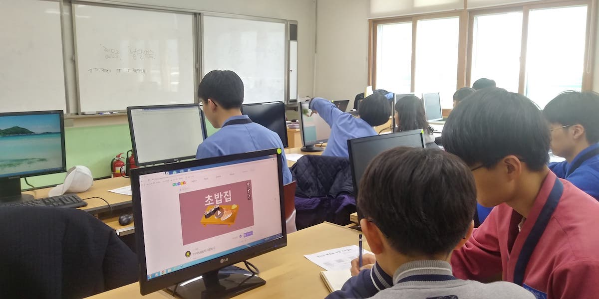
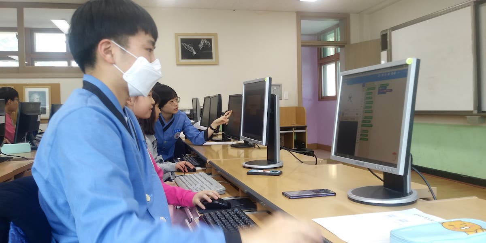
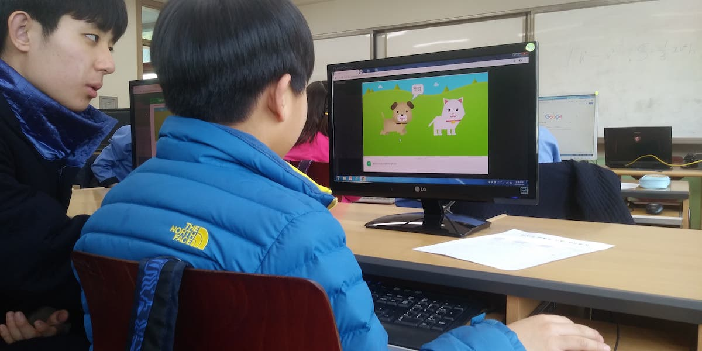
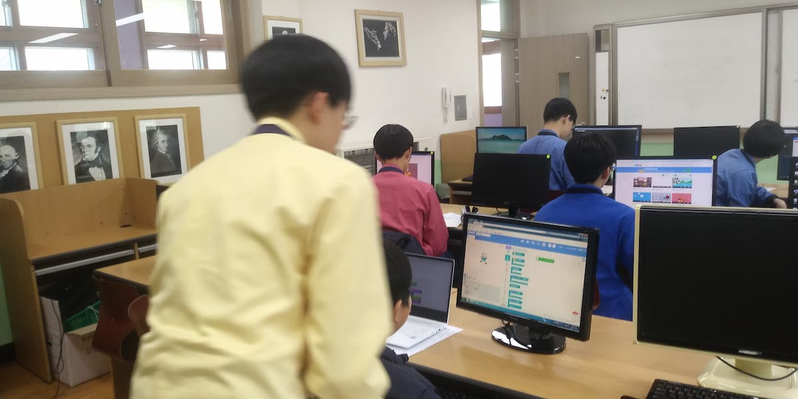

# 날짜
### 2019년 4월 4일 목요일

## 활동 인원
|활동 인원|역할|비고|
|----|----|----|
|노건호|총괄 & 부족한 부분 보강||
|김상윤|박승리 학생의 일대일 멘토||
|송정훈|이윤서 학생의 일대일 멘토|교육과정 팀에서 이동|
|이정달|임태준 학생의 일대일 멘토||
|이태훈|김한준 학생의 일대일 멘토||
|조성윤|김연아 학생의 일대일 멘토||
|최정웅|홍준표 학생의 일대일 멘토||
|한승민|김민찬 학생의 일대일 멘토|||

# 강의 내용 & 수업 자료
동일한 내용의 수업 자료를 [GitHub 오픈 소스 저장소](https://github.com/bcdkmla/dunnae2019/blob/master/PythonCurriculum/PythonClass3.md)에서도 확인하실 수 있습니다.

#### 키워드
`조건문`

## 조건문이란?

조건문이란 이름 그대로 **조건**을 따지는 제어문입니다.  
우리가 지정한 조건문의 조건이 참인지 거짓인지에 따라서 달라지는 계산이나 상황을 수행하는 것이 조건문입니다.

다음과 같은 상황을 생각해볼까요?

> 지갑에 돈이 있으면 아이스크림을 사먹고 없다면 사먹지 않는다

이와 같은 상황에서 우리는 조건인 **지갑에 돈이 있는지 없는지**를 확인한 뒤, 그에 따라 **아이스크림을 살지 말지**를 결정합니다. 프로그래밍에서도 마찬가지로, 조건문은 **조건을 판단**하여 해당 **조건에 맞는 내용을 수행**할지 결정하는 역할을 합니다.

## `if`
일반적으로 조건문을 사용할 때 가장 많이 사용되는 기본적인 단어입니다. 일반적인 구성은 다음과 같습니다.  

* `if`
* `elif` (else if)
* `else`

다음과 같이 실행되게 됩니다.

> Python은 `스페이스 4칸`으로 그룹을 분류합니다. 또한 `:` 의 사용도 조심하세요!

```python
if 조건1:
    print("조건1") # 조건 1이 맞다면 이 부분이 실행됩니다.
    
elif 조건2:
    print("조건2") # 조건 1이 틀리고 조건 2가 맞다면 이 부분이 실행됩니다.
    
else:
    print("조건3") # 조건 1과 조건 2 모두가 틀리면 이 부분이 실행됩니다.
```

### 도전

`a`가 10보다 크면 `큽니다.`를 그렇지 않으면 `작습니다.`를 출력하는 코드를 작성하시오.


<details><summary>정답 확인하기</summary>
<p>

```python
a = 10 # 원하는대로 이 값을 바꿔보고, 여러번 실행해보세요!

if  a > 10:
    print("큽니다.")
else:
    print("작습니다.")
```
</p>
</details>

## `elif`

`elif`는 else if 의 줄임으로, 프로그램에서 다양한 조건을 판단할 때 사용합니다. 조건, 개수의 제한을 받지 않고 사용할 수 있습니다.

방금 전에 `a`가 10보다 큰지 작은지 구하는 코드를 작성했습니다. 그렇다면 `a`가 10보다 큰지, 5에서 10 사이인지, 아니면 5보다 작은지를 판별하려면 어떻게 해야할까요?

```python
if a > 10:
    print("10보다 큽니다.")
elif a > 5: # ← 왜 10에 관한 이야기가 없을까요?
    print("10보다는 작지만 5보다는 큽니다.")
else:
    print("5보다도 작습니다.")
```

중간의 화살표 부분에 왜 10에 관한 이야기가 없을까요? 그 이유는 `elif` 자체가 앞서 나온 `if`의 조건문이 잘못되었을 때 실행되기 때문입니다.


|조건문|의미|
|----|----|
|`if 조건문1`|만약 조건문1이 맞다면 ...|
|`elif 조건문2`|그게 아니고 조건문2가 맞다면 ...|
|`else`|전부 아니라면 ...|

그렇기 때문에 위 코드는 이렇게 바꿀 수 있겠죠?

```
만약 a > 10 이 맞다면...
    print("10보다 큽니다.")
그게 아니고 a > 5 이 맞다면...
    print("10보다는 작지만 5보다는 큽니다.")
전부 아니라면...
    print("5보다도 작습니다.")
```

## 연산자

### 비교 연산자

조건문의 조건식에서 참인지 거짓인지 판단하기 위해 사용됩니다.


|비교 연산자|설명|
|----|----|
|`x > y`|`x`가 `y`보다 크다면 `True`, 아니라면 `False`|
|`x < y`|`x`가 `y`보다 작다면 `True`, 아니라면 `False`|
|`x != y`|`x`와 `y`는 다르다면 `True`, 아니라면 `False`|
|`x >= y`|`x`가 `y`보다 크거나 같다면 `True`, 아니라면 `False`|
|`x <= y`|`x`가 `y`보다 작거나 같다면 `True`, 아니라면 `False`|
|`x == y`|`x`와 `y`가 같다면 `True`, 아니라면 `False`|


### 다음 프로그램의 결과를 예측해 볼까요?

```python
x = 3
y = 4
z = 4

if x >= y:
    print("A")
else:
    print("B")
```

<details><summary>정답 확인하기</summary>
<p>
`x`는 `y`와 크거나 같지 **않으므로** `B`가 출력됩니다.
</p>
</details>

```python
x = 6
y = 6

if x <= y:
    print("A")
else:
    print("B")
```

<details><summary>정답 확인하기</summary>
<p>
`x`는 `y`와 작거나 같으므로 `A`가 출력됩니다.
</p>
</details>


```python
x = 7
y = 3

if x == y:
    print("A")
else:
    print("B")
```

<details><summary>정답 확인하기</summary>
<p>
`x`와 `y`는 서로 값이 다르므로 `B`가 출력됩니다.
</p>
</details>


## 참고: `input()` 함수
```python
a = input("안녕!")
```
`input()` 안에 있는 문자열이 우선 출력됩니다.  
사용자가 `어떤 값`을 입력하고 `enter`을 누르면, 그 `어떤 값`이 변수 `a` 안에 저장됩니다.

예를 들어,

```python
value = input("값을 입력하세요: ")
print("입력된 값:", value)
```

위 코드를 실행하면 처음 눈에 보이는 것은 다음과 같습니다.

```console
값을 입력하세요:
```

여기에 제가 `아이즈원 만세`라고 입력한다고 가정해봅시다.

```console
값을 입력하세요: 아이즈원 만세
```

그리고 `enter`을 눌렀습니다.  
그 순간 제가 입력한 `아이즈원 만세`라는 문자열 값은 `value`라는 변수 안에 대입되게 됩니다.  

그리고 그 다음 줄의 `print("입력된 값:", value)`가 실행됩니다.  
이때 `value`는 `아이즈원 만세`이기 때문에, 다음 결과가 눈에 보이게 됩니다.

```console
값을 입력하세요: 아이즈원 만세
입력된 값: 아이즈원 만세
```

`input()` 함수를 적당히 사용하면 원하는 값을 사용자에게 받아올 수 있습니다.

### 주의!  
`input()` 함수는 언제나 값을 **문자열**로 받아옵니다.  
만약 우리가 원하는 값이 정수형이라면 `int()`를 사용해서 추가적으로 그 값을 정수형으로 바꿔야 합니다.  
입력 받자마자 정수형으로 바꾸려면 `int(input())` 형태로 사용하면 되겠죠?

## 도전

`input()` 함수를 이용해 사용자로부터 어떤 값을 입력 받고, 그 값이 7의 배수인지 판별해보기!

<details><summary>정답 확인하기</summary>
<p>

### 중요
* `%`가 나누기 연산자임을 기억하고 활용하기

### 정답
```python
value = int(input('숫자를 입력하세요: '))

if value % 7 == 0:
    print("7의 배수입니다")
elif:
    print("7의 배수가 아닙니다")
```
</p>
</details>

# 수업 리포트

----

## 봉사자 김상윤, 배우미 박승리의 수업 리포트

### 수업 내용
* 저번 시간에 배웠던 색깔 바꾸기, 벽에 튕기기 기능 등 복습했습니다.
* 동작 간 시간을 두게 하는 방법, 일정거리를 이동하면 그 거리만큼 정확히 반대로 이동하는 방법 학습했습니다.

### 이해도
* 학생은 저번시간에 배운 것은 물론 이번에 새로 배운 내용들도 잘 숙지했습니다.

### 어려웠던 점
* 매번 타자를 쳐야 할 때마다 속도가 느려서 소비되는 시간이 많았던 것 같습니다.

### 제안 및 느낀 점
* 매주 타자 연습을 숙제로 해 왔으면 좋겠고 한 수업당 수업 내용을 늘려도 괜찮을 것 같습니다.

----

## 봉사자 송정훈, 배우미 이윤서의 수업 리포트

### 이해도
* 아무래도 저번 시간에 비해서는 난이도가 조금 높아 이해를 하는데 조금 시간이 걸리기는 했습니다. 
* 특히 윤서가 아직 좌표축을 배우지 않아 (x, y)를 완벽하게 이해하지는 못 한 것 같습니다. 그래도 x가 가로를 뜻하고, y가 세로를 뜻한다고 설명을 해주었더니 스스로 코드를 짜는 것을 보아 크게 지장은 없는 듯 합니다.

### 어려웠던 점
* 초등학생 수준에서 코드가 절차지향적으로 진행된다는 것과 x축으로 얼마만큼, y축으로 얼마만큼 이동하는 것을 설명하는 것이 조금 어려웠습니다.

### 수월했던 점
* 기본적으로 윤서가 코딩을 배우고자 하는 의지가 있습니다. 
* 또래 아이들보다 이해 속도가 빨라 어려운 설명도 잘 이해한 점이 기특했고, 가르치기 수월했습니다.

### 제안 및 느낀 점
* 윤서가 저번 시간에 배운 내용을 바탕으로 집에서 엔트리를 스스로 한 번 해보았다고 저에게 말해주었습니다. 확실히 집에서 조금이라도 복습을 해왔더니 실력이 전보다 향상되었다는 점을 느낄 수 있었습니다.
* 윤서가 앞으로도 하루에 5분씩 만이라도 복습을 하면 진도를 나갈 때 훨씬 수월하게 할 수 있을 것 같습니다.

----

## 봉사자 이정달, 배우미 임태준의 수업 리포트

### 수업 내용
* [엔트리 사이트](https://playentry.org/)에서 ‘동물 친구 이야기 만들기’를 학습
* 순차에 맞게 실행되는 코드의 원리, 블록들을 병렬로 연결하는 방법, 반복하기 블록을 적절히 활용하는 방법을 배움

### 이해도
* 처음에는 반복하기 블록 활용을 어려워하는 것처럼 보였지만, 점점 익숙하게 사용했습니다.

### 어려웠던 점
* 타자를 잘 하지 못하여서 시간이 오래 걸렸습니다.

### 수월했던 점
* 학생이 잘 이해를 해서 쉽게 수업을 진행할 수 있었습니다.

### 제안 및 느낀 점
* 정해진 과정을 따르게 함으로써 가르치는 것과 함께 매 수업의 마지막 5분에서 10분 정도는 자유롭게 코딩할 수 있도록 하는 것도 좋을 듯 합니다. 
* 여러가지로 초등학교 3학년이 코딩을 배운다는 것이 어렵다는 생각이 들지만, 천천히 배워나가면 될 것 같습니다.

----

## 봉사자 이태훈, 배우미 김한준의 수업 리포트

### 수업 내용
학생이 이번에도 수업에 불참하였습니다.

----

## 봉사자 조성윤, 배우미 김연아의 수업 리포트

### 수업 내용
* 엔트리 강좌 중 조금 더 심화된 내용을 수강했습니다.
* 저번과 마찬가지로 학생 혼자서 풀어보다가 가끔 조금 더 효율적인 풀이가 존재하거나 접근법을 학생이 모를 때 가르쳐주는 방식으로 진행

### 이해도
* 엔트리 기본 조작법을 가르쳐주려고 시작한 것이었지만 기본 조작법 뿐만 아니라 원하는대로 움직일 때 필요한 블럭이 무엇인지까지 이해하고 활용할 수 있는 정도까지 이해한 것 같습니다.

### 어려웠던 점
* 학생이 효율적인 풀이가 무엇인지 깨닫지 못하는 (ex. `for` 문을 사용해야될 때 사용하지 않고 더 많은 수의 블럭을 사용하여 문제를 풀어내는 것) 경우가 종종 있어서 가끔 수정해 주어야 했습니다.

### 수월했던 점
* 그러나 학생이 배우려는 열의가 있고 혼자서 대부분은 문제를 풀어냈기 때문에 많은 부분에서 수월했습니다.

### 제안 및 느낀 점
* 다음 시간과 몇 수업 동안에는 엔트리로 학생이 원하는 게임을 만들어 볼 예정입니다. 그것이 끝난 후에는 파이썬을 사용해서 학생을 가르쳐 볼 예정입니다.

----

## 봉사자 최정웅, 배우미 홍준표의 수업 리포트

### 수업 내용
학생이 수업에 참여하지 않아 아무것도 하지 못했습니다.

----

## 봉사자 한승민, 배우미 김민찬의 수업 리포트

### 수업 내용
* 지난 시간 배웠던 `print` 문을 복습했습니다.
* `input` 문 학습, `input` 문과 cmd를 활용해 컴퓨터와 상호작용하는 법을 학습했습니다.
* 이번 시간 부터는 파이썬과 더불어 엔트리를 이용해 게임을 만드는 프로젝트를 시작하였고, 이번 시간에는 아이디어를 구상했습니다.
* 엔트리의 변수 개념과 연관지어 파이썬의 변수 개념을 익혔습니다.
* 정수형 변수에 대해 학습 후 정수형 변수 개념과 `input`, `print` 문을 활용해 세 수의 평균을 구하고 출력하는 프로그램을 스스로 작성했습니다.
* `cmd`에서 Python을 실행시키고 `cd`명령어를 이용해 파일 디렉토리를 옮겨다니는 방법을 학습했습니다.

### 이해도
* 오늘은 ‘변수’라는 어려운 개념을 익혔는데, 파이썬을 처음 시작하는 초등학생에게는 생소할 수 있는 개념이었음에도 엔트리를 통해 어느 정도 프로그래밍과 친해져 있었기 때문에 이런 개념도 어려움 없이 잘 이해했습니다.
* Cmd에서 cd를 통해 파일 디렉토리를 옮겨 다니는 법도 컴퓨터를 많이 다뤄보았던 덕분인지 잘 이해했습니다.
* 전반적인 수업에 대한 이해도가 뛰어난 학생입니다.

### 어려웠던 점
* 엔트리를 통해 고품질의 게임을 만드는 프로젝트를 이번 시간부터 시작했고,  이번 시간에는 게임에 대한 전반적인 아이디어를 구상해봤지만 친구는 물론이고 저 조차도 아이디어가 잘 나오지 않아 조금 어려웠음.
*  프로그래밍에 관해 가르칠 때에는 어려움 없이 잘 따라와줬습니다.

### 수월했던 점
* 영어 알파벳을 잘 알고있고, 초등학교 6학년 수준에서는 평균 이상의 영어 실력을 가지고 있어 print, input의 뜻을 비롯한 프로그래밍 언어들을 잘 이해했습니다.

### 제안 및 느낀 점
* 민찬이의 경우 엔트리를 잘 다룰 줄 알고, 그렇기 때문에 프로그래밍에 대한 어느정도의 감각이 있습니다. (반복문과 조건문 등 프로그래밍에서 익히 잘 사용되는 제어문에도 익숙했음.)
* 또한 이번시간 부터는 엔트리에도 시간을 조금 배분하여, 멘티 친구의 창의력을 발휘해 게임을 만드는 프로젝트를 구현하고 있습니다. 
* 엔트리로 하는 프로젝트와 `Python` 내용 모두 다 잘 따라와 주고 있어, 앞으로의 미래가 기대됩니다.

----

# 활동 사진




